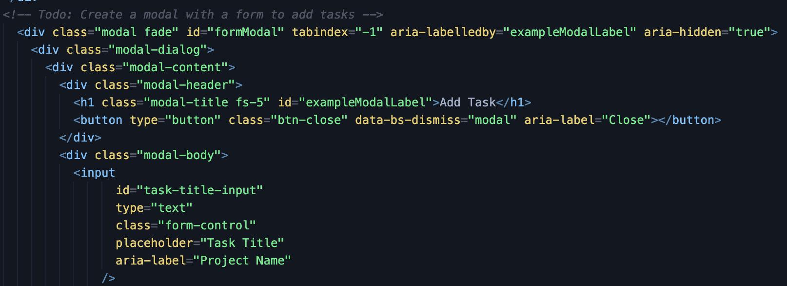
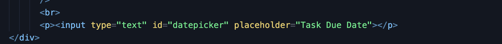
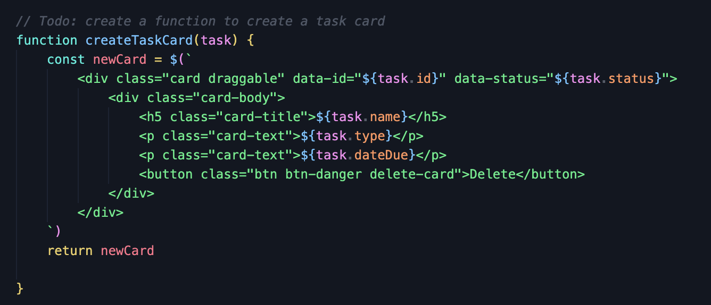
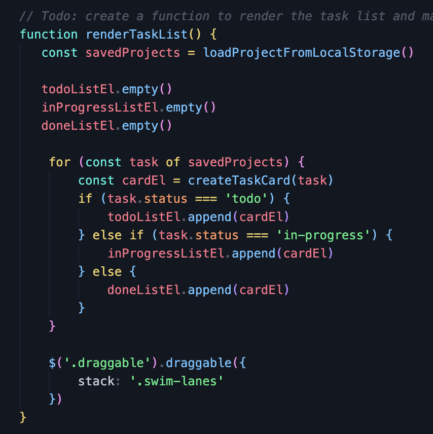
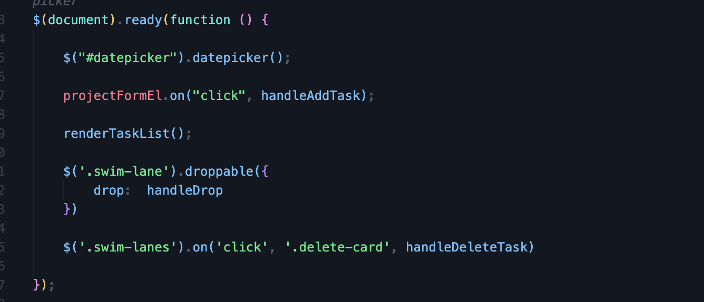
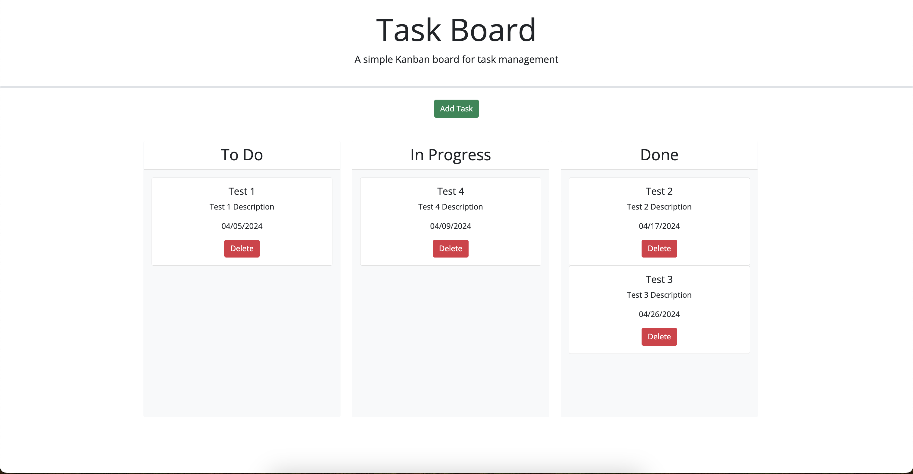

# task-board

## What Is A Task Board?
* A task board is a digital tool used to organize and track tasks, projects, goals, and initiatives. It provides a visual representation
A task board is a digital tool that allows teams to organize and track project tasks in real time. It provides an interactive platform for team members.

## What Was The Problem With Web Page?
* There was no modal forms starter codes for web page.
* Date picker were not working proparly.
* There was no cards for each task in javascript file.
* Cards were not draggable to "in progress" column.
* Delete button did nothing when clicked on it.

## How Did I Solve The Problems?
*  Created a modal form using Bootstrap and modified to  fit the needs of my project. Added event listener to open this form by clicking on 'Add New' button.
* 
* I couldn't find any existing datepicker so, I used the jQuery UI library which is a powerful and customizable datepicker. 
* 
* I made ```const newCard``` to store and create a card element using Jquery.And every task values I used ```${task.id}``` method.

* My cards were not draggable into the "In Progress" column because I had typo error in my code, so I fixed that by adding ```-``` for example it was ```'in progress'``` and solution was adding ```-``` between in and progress ```in-progress```.
* 
* For the delete button I had typo error in my code, so I fixed that by adding ```.``` for example it was ```delete-card``` and solution was adding ```.``` in front of delete card class ```'.delete-card'```.
* 

## Application Page
* 

## Links

* [Github Repository](https://github.com/veyselarslan12/personal-blog)

* [Deployment Website Link](https://veyselarslan12.github.io/personal-blog/)
